# อำดง

This diagram is made just for fun for making a digram of words play from [this bluesky thread](https://bsky.app/profile/mattmek.bsky.social/post/3lebb2p2thk2w).  
Starts with "อำดง" and ends with "อำดง".

## stats

- Total words: 469
- Total days: 6 (27 Dec 2023 - 1 Jan 2024)
  - 27 Dec: 35 words
  - 28 Dec: 92 words
  - 29 Dec: 187 words
  - 30 Dec: 59 words
  - 31 Dec: 75 words
  - 1 Jan: 21 words
- Number of completed branch: 4
- Number of dead branch: 11
- Number of duplicated words: 27
  - ลูบูแตง: 2
  - อำแดง: 2
  - กำแพง: 2
  - บิ๊กแบง: 2
  - ครองแครง: 2
  - ทองแดง: 2
  - โน้ต: 2
  - โกรธ: 2
  - ปราโมทย์: 2
  - สมโภช: 2
  - ดาวน์โหลด: 2
  - อาลัว: 2
  - งู: 3
- Number of changed vowels/consonants: 18

## diagram

```mermaid
---
title: "ประวัติศาสตร์การเล่นคำอำดง"
---
flowchart TD
  classDef start fill:#f542e9,color:#000
  classDef complete fill:#06c23e,color:#000
  classDef cut fill:#c139f7,color:#000
  classDef dup fill:#e31227,color:#000
  classDef trans fill:#f7f439,color:#000

  subgraph definition
    def1["เริ่มอำดง"]:::start
    def2["จบอำดง"]:::complete
    def3["ตัดจบ"]:::cut
    def4["คำซ้ำ"]:::dup
    def5["เปลี่ยนสระ/ตัวสะกด"]:::trans
  end

  subgraph day1 ["27 Dec (35 คำ)"]
    a1["อำดง"]:::start --> a2["กลางดง"] --> a3["อุด้ง"] --> a4["อัสดง"] --> a5["ธุดงค์"]
    --> a6["กิวด้ง"] --> a7["โดดดิด่ง"] --> a8["เมียงดง"] --> a9["ยาดง"] --> a10["ยาดม"] 
    --> a11["ยาอม"] --> a12["วงกลม"] --> a13["คาเบะด้ง"] --> a14["กระด้ง"] --> a15["กระทง"]:::trans
    --> a16["กระโปรง"]:::trans --> a17["กระดอง"] --> a18["ยาดอง"] --> a19["ลำยอง"] --> a20["ระยอง"]
    --> a21["กระบอง"] --> a22["กาสะลอง"] --> a23["ประลอง"] --> a24["ลำลอง"] --> a25["ปรองดอง"] 
    --> a26["ปอยส่างลอง"] --> a27["ปลาทอง"] --> a28["ป่าตอง"] --> a29["เปตอง"] --> a30["ปาปิญอง"]
    --> a31["แชมปิญอง"] --> a32["อันยอง"] --> a33["ลองกอง"] --> a34["ชีฟอง"] --> a35["ยองๆ"] 
  end

  subgraph day2 ["28 Dec (92 คำ)"]
    a35 
    --> a36["ชเวดากอง"] --> a37["ฝอยทอง"] --> a38["ยามอุบากอง"] --> a39["ฌอง วัลฌอง"] --> a40["ฟองดอง"]
    --> a41["บาตอง"] --> a42["ใบตอง"] --> a43["คำพ้อง"] --> a44["คำคล้องจอง"] --> a45["ดอมเปริญอง"]
    --> a46["เดบูตองส์"] --> a47["ลูบูแตง"]:::dup --> a48["กราแตง"] --> a49["โอ บอง แปง"] --> a50["พระประแดง"] 
    --> a51["เมอแรงก์"] --> a52["แมลง"] --> a53["พะแนง"] --> a54["อ่อนแรง"] --> a55["อับแซ็งธ์"]
    --> a56["อาทิตย์อับแสง"] --> a57["อำแดง"]:::dup --> a58["อำดง"]:::complete

    a53
    --> b1["หมดแรง"] --> b2["กำแพง"]:::dup --> b3["ไม้ระแนง"] --> b4["เส้นแวง"] --> b5["พระแพง"]
    --> b6["หวาดระแวง"] --> b7["นอนตะแคง"] --> b8["บิ๊กแบง"]:::dup --> b9["พลิกแพลง"] --> b10["พริกแกง"]
    --> b11["วัดแจ้ง"] --> b12["มะแว้ง"] --> b13["กำแหง"] --> b14["กำแพง"]:::dup --> b15["เมืองแกลง"]
    --> b16["มะล่องก่องแก่ง"] --> b17["คำแพง"] --> b18["เลอแวง"] --> b19["มะละแหม่ง"] --> b20["มะม่วงมันหนองแซง"]
    --> b21["หนังกลางแปลง"] --> b22["ครองแครง"]:::dup --> b23["ตะแคง"] --> b24["แสวง"] --> b25["หนมหม้อแกง"]
    --> b26["สันกำแพง"] --> b27["(พ่อขุน)รามคำแหง"] --> b28["ป๋องแป๋ง"] --> b29["ปะแป้ง"] --> b30["ปลาแห้ง"]
    --> b31["จักรยานสีแดง"] --> b32["ถุงแกง"] --> b33["มื้อแลง"] --> b34["เมอแรงค์"] --> b35["ยาแดง"]
    --> b36["เลอแปง"] --> b37["สังเคราะห์แสง"] --> b38["ของแพง"] --> b39["กาบหอยแครง"] --> b40["ผัดผักแขนง"]
    --> b41["บิ๊กแบง"]:::dup --> b42["โชแปง"] --> b43["บูมเมอแรง"] --> b44["ทอม แฮงค์"] --> b45["ซาแซง"]
    --> b46["ครองแครง"]:::dup --> b47["มองแรง"] --> b48["ยุแยง"] --> b49["หม้อแปลง"] --> b50["โกแก็ง"]
    --> b51["สมบัติการแจกแจง"] --> b52["โรแด็ง"] --> b53["เดอกาแวง"] --> b54["มัสแต็ง"] --> b55["ทองแดง"]:::dup
    --> b56["ลูกแป้ง"] --> b57["ศาลาแดง"] --> b58["ไอติมไข่แข็ง"] --> b59["ฟักแฟง"] --> b60["หมูแดง"]
    --> b61["จะแจ้ง"] --> b62["แข็งแรง"] 

    b53
    --> c1["อีฟแซ็งส์โรแลง"] --> c2["แต๋งแต๋ง"] --> c3["หอยจุ๊บแจง"] --> c4["หอยแครง"] --> c5["สางแปลง"]
    --> c6["ทองแดง"]:::dup --> c7["อาร์แซน ลูแปง"]
  end

  subgraph day3 ["29 Dec (187 คำ)"]
    b62 --> b63["ข้อเท้าแพลง"] --> b64["ของแสลง"] --> b65["ไข้อีดำอีแดง"]
    --> b66["อำแดง"]:::dup --> b67["อำดง"]:::complete

    c7 --> c8["สายแท้งก์"] --> c9["ลงแร้งค์"] --> c10["คลาแรงส์"]
    --> c11["ลูบูแตง"]:::dup --> c12["อีฟแซง"] --> c13["อีฟนิ่งพริมโรส"]:::trans --> c14["เดอะโกสท์"] --> c15["คำชะโนด"]
    --> c16["วัดโบสถ์"] --> c17["ข้าวโพด"] --> c18["โน้ต"]:::dup --> c19["ผีโขมด"] --> c20["โกรธ"]:::dup
    --> c21["หลอดไดโอด"] --> c22["ตาลโตนด"] --> c23["เป็นโยชน์"] --> c24["เอกโทษโทโทษ"] --> c25["เริ่มโกดดดด"]:::dup
    --> c26["สมโภช"]:::dup --> c27["กระโดด"] --> c28["โฟร์โมสต์"] --> c29["โอ๊ต ปราโมทย์"]:::dup --> c30["สละโสด"]
    --> c31["โค้ช"] --> c32["ฟรุกโตส"] --> c33["ตัวโน้ต"]:::dup --> c34["แล็กโทส"] --> c35["สมโภช"]:::dup
    --> c36["โฮสต์"] --> c37["โกฏ"] --> c38["โพสต์"] --> c39["โด๊ส"] --> c40["โรส"]
    --> c41["โทสต์"] --> c42["โคลส"] --> c43["Disclose"] --> c44["โบ๊ธ"]:::cut
    
    c31
    --> e1["ยาโด๊ป"]:::cut

    c20
    --> d1["ต้นตาลโตนด"] --> d2["ลูกโดด"] --> d3["โหวต"] --> d4["เหี้ยมโหด"] --> d5["รอพระมาโปรด"]
    --> d6["สถานะโสด"] --> d7["ดาวน์โหลด"]:::dup --> d8["ซอร์สโค้ด"] --> d9["โดริโทส"] --> d10["โจทก์"]
    --> d11["โฉนด"] --> d12["โปรโมต"] --> d13["ดาวน์โหลด"]:::dup --> d14["มาโนช"] --> d15["ไนท์โหมด"]
    --> d16["ฟาโรส"] --> d17["ทรงพระพิโรธ"] --> d18["เดอะไวท์โร้ด"] --> d19["ปราโมทย์"]:::dup --> d20["เครโทส"]
    --> d21["ชูโรส"] --> d22["ติมโฟลต"] --> d23["โต๊ด"] --> d24["อาดิโอส"] --> d25["ซมโต๊ส"]
    --> d26["บาร์เบโดส"] --> d27["ฟุ้ตโน้ต"] --> d28["บาร์บาทอส"]:::trans --> d29["ลูกอ๊อด"]:::cut


    b66
    --> f1["สีดำ"]:::trans --> f2["เยโล่ว"]:::trans --> f3["แตงโม"] --> f4["อีโต้"] --> f5["ไอวีโก้"]
    --> f6["ฟีโน่"] --> f7["ปีโป้"] --> f8["โกโก้"] --> f9["โลโก้"] --> f10["ฮิปโป"]
    --> f11["จิงโจ้"] --> f12["ดัมโบ้"] --> f13["แมงโก้"] --> f14["ปริสุทโธ"] --> f15["โอโม"]
    --> f16["เลโก้"] --> f17["โปเตโต้"] --> f18["โอรีโอ้"] --> f19["โอ้โห"] --> f20["โอโจ้"]
    --> f21["โมโจ โจโจ้"] --> f22["โมฮิโต้"] --> f23["อามิโก้"] --> f24["อะมีบ้า"]:::trans --> f25["อกาธ่า"]
    --> f26["เวนาซุเอล่า"] --> f27["บุนเดสลิก้า"] --> f28["ลาลีก้า"] --> f29["วากา วาก้า"] --> f30["อินเดียน่า"]
    --> f31["เซวีน่า"] --> f32["บาบายาก้า"] --> f33["รูสซัลก้า"] --> f34["โอเปร่า"] --> f35["Habanera"]
    --> f36["จูเลียส ซีซาร์"] --> f37["ท่านเคานต์แดร็กคูล่า"] --> f38["อัลปาก้า"] --> f39["อัมพวา"] --> f40["อาลัมบรา"]
    --> f41["เกรนาด้า"] --> f42["มาริโพซ่า"] --> f43["เอสเมอรัลด้า"] 

    f43
    --> g1["ปันหยีหิก"]:::trans --> g2["วิก"] --> g3["ซิกส์"] --> g4["แต่งฟิค"] --> g5["แซฟฟิก"]
    --> g6["ลิปสติก"] --> g7["อิลสลิก"] --> g8["ปาราชิก"] --> g9["หนังสติ๊ก"] --> g10["อคริลิค"]
    --> g11["พลาสติก"] --> g12["เสาดอริก"] --> g13["คาธอลิก"] --> g14["คณะอัศวินทิวทอนิก"] --> g15["เดอะแมตทริกซ์"]
    --> g16["เซนต์ดอมินิค"] --> g17["เน็ตฟลิกซ์"] --> g18["จูราสสิค"] --> g19["บีควิก"] --> g20["บีกินส์"]:::trans
    --> g21["เดอะบีเทิลส์"]:::trans --> g22["บีเกิ้ล"] --> g23["บีลิเบอร์"] 
  
    f43 --> f44["บุษบา"] --> f45["ฟ้า"]
    --> f46["คงคา"] --> f47["คลองปานามา"] --> f48["อาธีน่า? ทุรคา? มารีอา?<br>เฉลย อัปสรา"] --> f49["ซาโมซ่า"] --> f50["แมกมา"]
    --> f51["ลาวา"] 
  
    g12
    --> h1["เซ็ดดริก"] 

    f29
    --> j1["เลดี้กาก้า"] --> j2["ปากอ้า"] --> j3["ปากกา"] --> j4["คุณตา"] --> j5["คุณอา"]
    --> j6["คุณป้า"] --> j7["คุณน้า"] --> j8["หลานม่า"] --> j9["ซัลซ่า"] --> j10["มาม่า"]
    --> j11["ปาปริก้า"] --> j12["ปลาร้า"] --> j13["สามช่า"] --> j14["โตชิบ้า"] --> j15["พุมบ้า"]
    --> j16["ม้า"] --> j17["เวลา"] --> j18["ยาพารา"] --> j19["พสุธา"] --> j20["ยามาฮ่า"]
    --> j21["แตงกวา"] --> j22["จาการ์ตา"] --> j23["เสือจากัวร์"]:::trans --> j24["หนุ่มเลี้ยงวัว"] --> j25["ดอกบัว"]
    --> j26["ไส้อั่ว"] --> j27["อาลัว"]:::dup --> j28["มั่ว"] --> j29["ถั่ว"] --> j30["ตะกั่ว"]
    --> j31["ห้องครัว"] 

    j31
    --> k1["ทัวร์"]:::cut
    j31 --> j32["ผัว"] --> j33["คลชั่ว"] --> j34["ผงนัว"] --> j35["โปรโตซัว"]
    --> j36["เจ้าสัว"] --> j37["อาลัว"]:::dup --> j38["สามแม่ครัว"] --> j39["สลัว"]
  end

  subgraph day4 ["30 Dec (59 คำ)"]
    f51 --> f52["ลามะลิลา"] --> f53["ศกุนตลา"] --> f54["มัทนา"] --> f55["นางโมรา"]
    --> f56["รจนา"] --> f57["นางกุลา"] --> f58["อิลา"] --> f59["มโนราห์"] --> f60["ละเวงวันฬา"]
    --> f61["วิยะดา"] --> f62["วนิลา"] --> f63["ขอลา"] --> f64["ฟา"] --> f65["ขอขมา"]
    --> f66["ลาล่า"] --> f67["วิสาขบูชา"]:::cut

    j39 --> j40["ตามัว"]
    --> j41["โบรชัวร์"] --> j42["แม่หยัว"] --> j43["แอมยัวส์"] --> j44["มั่วๆ สั่วๆ<br>เฉลย ทั่ว"] --> j45["ชัวร์"]
    --> j46["โอ่ เคอวัว"] --> j47["เฮ่ ดัว"] --> j48["ฮินดู"]:::trans --> j49["มันดู"] --> j50["มันจู"]
    --> j51["อาลู"] --> j52["คำปู้จู้"] --> j53["อวิ๋นเซินปู้จื้อฉู่"] --> j54["กูซู"] --> j55["สบู่"]
    --> j56["แชมพู"] --> j57["งู"]:::dup --> j58["ปู"] --> j59["หญ้าเจ้าชู้"] --> j60["แสนรู้"]
    --> j61["ยาคูลท์"] --> j62["ยักษ์คู่"] --> j63["แทททู"]

    j63 
    --> m1["รายได้"]:::trans

    j63 --> j64["เงินกู้"] --> j65["ทิชชู่"]
    --> j66["ตองอู"] --> j67["เมนู"] --> j68["ไดรฟ์ทรู"] --> j69["ชาบู"] --> j70["หนวกหู"]
    --> j71["เต้าหู้"] --> j72["คาร์ฟูร์"] --> j73["ติ้วหู"] --> j74["วงพรู"] --> j75["งู"]:::dup
    --> j76["ไป๋หู"] --> j77["ธนู"] --> j78["เป็นคู่"] --> j79["รู"] --> j80["ดังฟู่"]
    --> j81["ปีงู"]:::dup
  end

  subgraph day5 ["31 Dec (75 คำ)"]
    
    j81 --> j82["รูปี"]:::trans --> j83["โรตี"] --> j84["ทันดูรี"] --> j85["ทีลอซู"]:::trans
    --> j86["ปลาทู"] --> j87["ปาป้า-ทูทู่"] --> j88["บางปู"] --> j89["ไอเลิฟยู"] --> j90["คธูลู"]
    --> j91["R2D2"] --> j92["ฮิคารุ ซูลู"] --> j93["มูหู"] --> j94["อู่"] --> j95["เฉิงตู"]
    --> j96["ปิ๊กาจู"] --> j97["คุณครู"] --> j98["เซ็นคู"] --> j99["ต่างหู"] --> j100["ไทจู"]
    --> j101["ต่อสู้"] --> j102["กล้องโทรทรรศน์แบบเลนส์คู่"] --> j103["สาว สาว สาว"]:::trans

    m1 --> m2["จังไร"] --> m3["ปีใหม่"] --> m4["ซันไลต์"] --> m5["เจได"]
    --> m6["หัวใจ"] --> m7["ฟ้าใส"] --> m8["หยากไย่"] --> m9["ลำไย"] --> m10["แตงไทย"]
    --> m11["ไห"] --> m12["ตะไคร้"] --> m13["ตะใคร่"] --> m14["ผิงไฟ"] --> m15["ชิดใน"]
    --> m16["ชักใย"] --> m17["สมองไหล"] --> m18["พิมพิลาไลย"] --> m19["ไวไว"] --> m20["ไปไหน"]
    --> m21["อะไร"] --> m22["เท่าไหร่"] --> m23["ยังไง"] --> m24["ทำไม"] --> m25["ไหม"]
    --> m26["ไป"] --> m27["ได้"] --> m28["(ร้อง)ไห้"] --> m29["(เห็น)ใจ"] --> m30["หมดไฟ"]
    --> m31["วงกลม"]:::trans --> m32["ยม"] --> m33["พระพรหม"] --> m34["<br>มนต์นม? ไก่ย่างตำส้ม?<br>ข้าวต้ม?"] --> m35["เมตตามหานิยม"]
    --> m36["เป็นลม"] --> m37["ลูกอม"] --> m38["อาศรม"] --> m39["ใต้ตม"] --> m40["ช่วยงม"]
    --> m41["อารมณ์"] --> m42["อาคม"] --> m43["ติดลม"] --> m44["บรรทม"] --> m45["เทพนม"]
    --> m46["หมักหมม"] --> m47["ทับถม"] --> m48["สาสม"] --> m49["ยาดม"]

    m11 --> n1["ใจ"]:::cut
    g23 --> g24["บีเวอร์"] --> g25["โกเฟอร์"]:::cut
    h1 --> h2["ฟอเรนสิก"]:::cut
    g9 --> i1["พริก"]:::cut
  end

  subgraph day6 ["1 Jan (21 คำ)"]
    j103 --> l1["กาว"]:::cut

    m49 --> m50["ผ้าห่ม"]
    --> m51["จงกรม"] --> m52["หอยนางรม"] --> m53["ชะอม"] --> m54["บรรจง"]:::trans --> m55["กระพง"]
    --> m56["ธงไตรรงค์"] --> m57["หูกระจง"] --> m58["ตัวชง"] --> m59["สุพรรณหงส์"] --> m60["คนทรง"]
    --> m61["อาวขง"] --> m62["อำดง"]:::complete

    m58
    --> o1["งุนงง"] --> o2["ปลง"] --> o3["ปีชง"] --> o4["อำดง"]:::complete

    m55
    --> p1["ดั่งใจจง"] --> p2["รณรงค์"] --> p3["ไคฟง"]:::cut
  end
```

