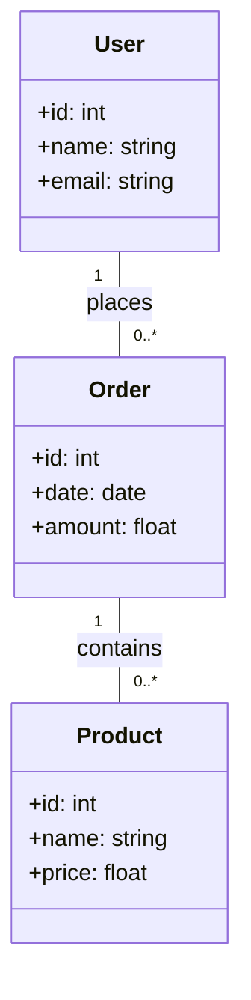

# Mermaid diagram - Class Diagram

doc: [classDiagram Syntax | Mermaid](https://mermaid.js.org/syntax/classDiagram.html)

```mermaid
classDiagram
    title Class Diagram Example
    class User {
        +id: int
        +name: string
        +email: string
    }
    class Order {
        +id: int
        +date: date
        +amount: float
    }
    class Product {
        +id: int
        +name: string
        +price: float
    }
    
    User "1" -- "0..*" Order : places
    Order "1" -- "0..*" Product : contains
```
