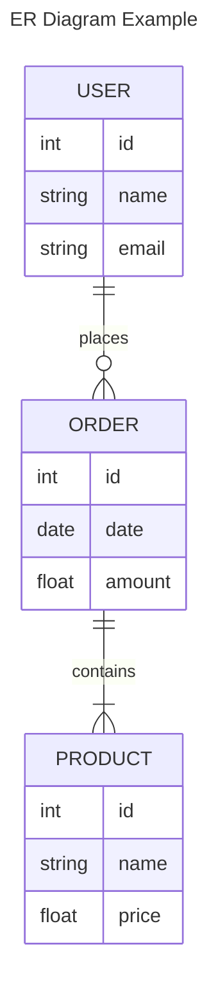

# Mermaid diagram - ER Diagram

doc: [ER Diagrams Syntax \| Mermaid](https://mermaid.js.org/syntax/entityRelationshipDiagram.html)

```mermaid
---
title: ER Diagram Example
---
erDiagram
  USER {
      int id
      string name
      string email
  }
  ORDER {
      int id
      date date
      float amount
  }
  PRODUCT {
      int id
      string name
      float price
  }

  USER ||--o{ ORDER : places
    ORDER ||--|{ PRODUCT : contains
```
