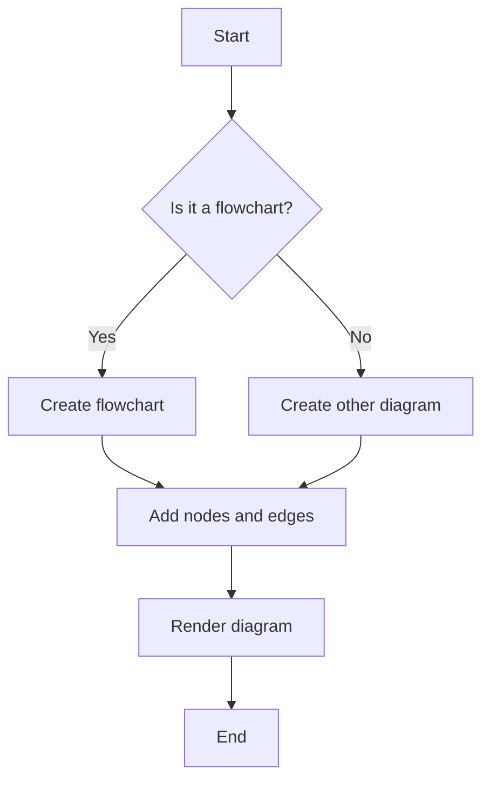

# Mermaid diagram - Flowchart

Doc: [Flowcharts Syntax \| Mermaid](https://mermaid.js.org/syntax/flowchart.html)

```mermaid
flowchart TD
    A[Start] --> B{Is it a flowchart?}
    B -- Yes --> C[Create flowchart]
    B -- No --> D[Create other diagram]
    C --> E[Add nodes and edges]
    D --> E
    E --> F[Render diagram]
    F --> G[End]
```
