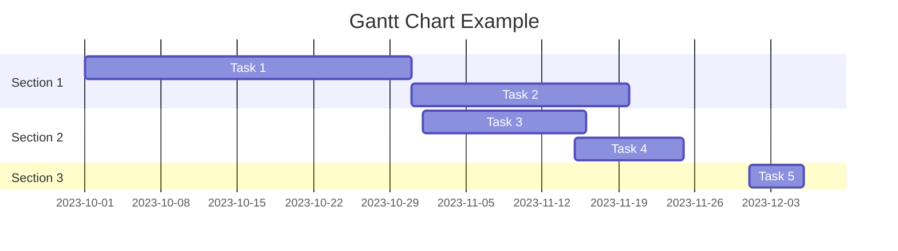

# Mermaid diagram - Gantt Chart

doc: [Gantt Syntax | Mermaid](https://mermaid.js.org/syntax/gantt.html)

```mermaid
gantt
    title Gantt Chart Example
    dateFormat  YYYY-MM-DD
    section Section 1
    Task 1 :a1, 2023-10-01, 30d
    Task 2 :after a1, 20d
    section Section 2
    Task 3 :2023-11-01, 15d
    Task 4 :2023-11-15, 10d
    section Section 3
    Task 5 :2023-12-01, 5d
```
