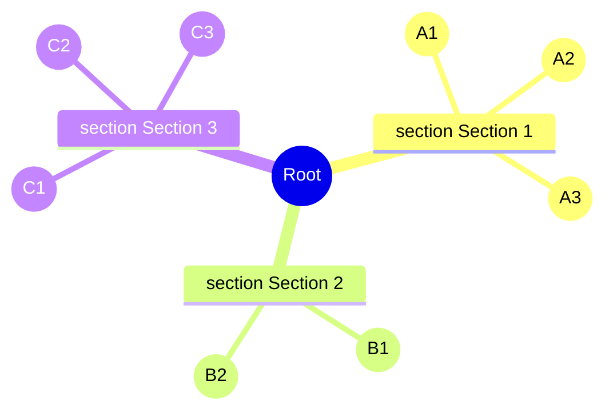

# Mermaid diagram - Mindmap

doc: [Mindmap Syntax | Mermaid](https://mermaid.js.org/syntax/mindmap.html)

```mermaid
mindmap
    root((Root))
      section Section 1
          A1((A1))
          A2((A2))
          A3((A3))
      section Section 2
          B1((B1))
          B2((B2))
      section Section 3
          C1((C1))
          C2((C2))
          C3((C3))
```
