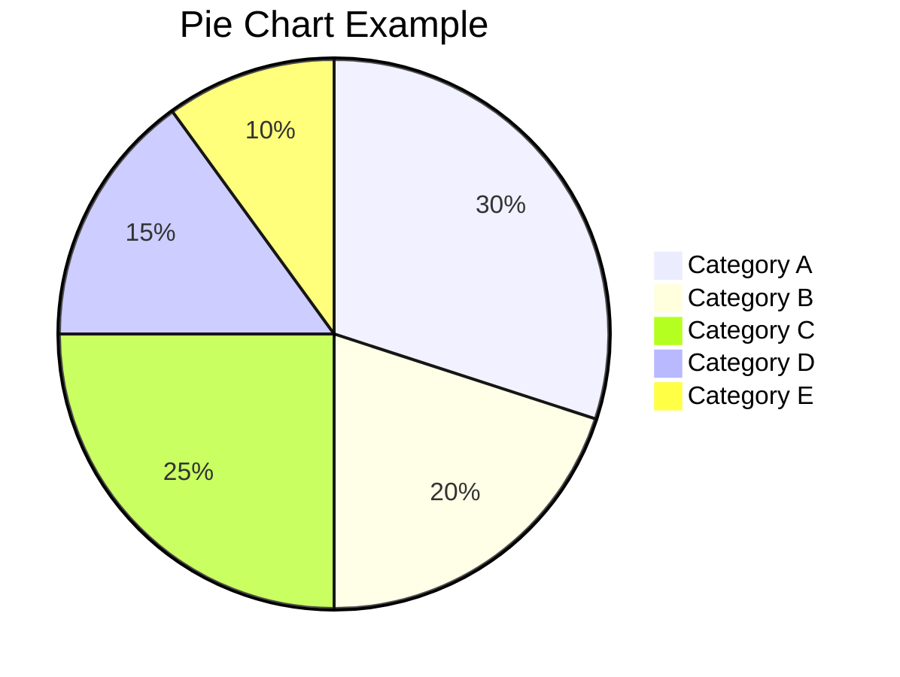

# Mermaid digram - Pie Chart

doc: [Pie Chart Syntax | Mermaid](https://mermaid.js.org/syntax/pie.html)

```mermaid
pie
    title Pie Chart Example
    "Category A": 30
    "Category B": 20
    "Category C": 25
    "Category D": 15
    "Category E": 10
```
