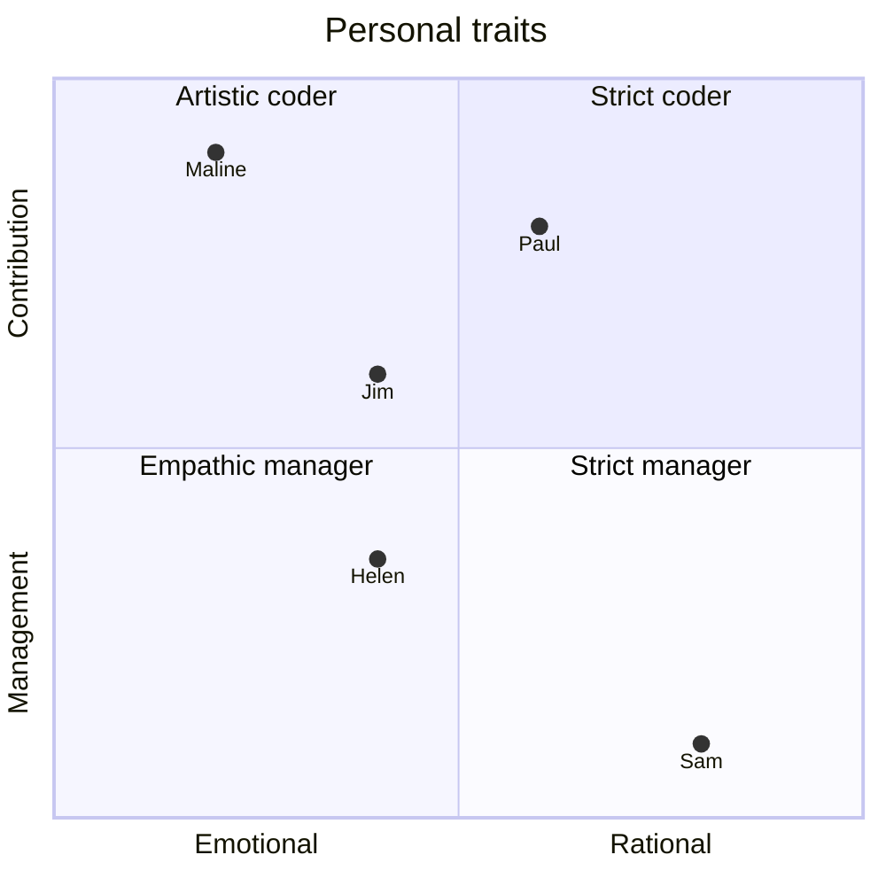

# Mermaid diagram - Quadrant

doc: [Quadrant Syntax | Mermaid](https://mermaid.js.org/syntax/quadrant.html)

```mermaid
---
title: Personal traits
config:
---
quadrantChart
    x-axis "Emotional" --> "Rational"
    y-axis "Management" --> "Contribution"
    
    quadrant-1 Strict coder
    quadrant-2 Artistic coder
    quadrant-3 Empathic manager
    quadrant-4 Strict manager

    Paul    : [0.6, 0.8]
    Maline  : [0.2, 0.9]
    Sam     : [0.8, 0.1]
    Helen   : [0.4, 0.35]
    Jim     : [0.4, 0.6]
```
