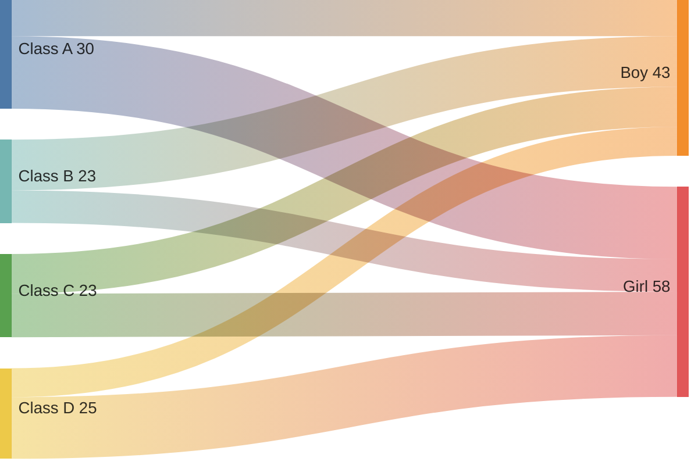

# Mermaid diagram - Sankey

doc: [sankey Syntax | Mermaid](https://mermaid.js.org/syntax/sankey.html)

```mermaid
---
title: numbers of students
config:
  showValues: true
---
sankey-beta
  Class A, Boy, 10
  Class A, Girl, 20
  Class B, Boy, 14
  Class B, Girl, 9
  Class C, Boy, 11
  Class C, Girl, 12
  Class D, Boy, 8
  Class D, Girl, 17
  
```
