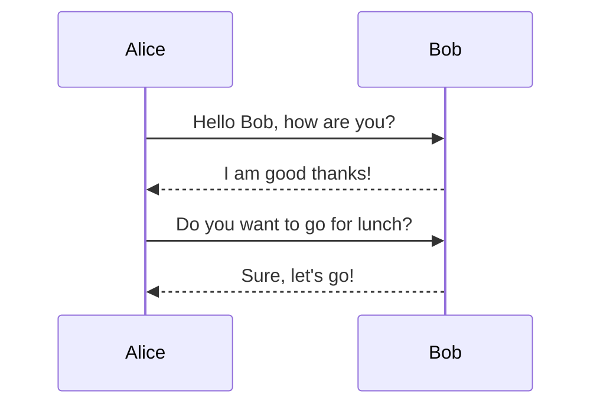

# Mermaid diagram - Sequence Diagram

doc: [Mermaid Sequence Diagram](https://mermaid.js.org/syntax/sequenceDiagram.html)

```mermaid
sequenceDiagram
    participant Alice
    participant Bob
    Alice->>Bob: Hello Bob, how are you?
    Bob-->>Alice: I am good thanks!
    Alice->>Bob: Do you want to go for lunch?
    Bob-->>Alice: Sure, let's go!
```
