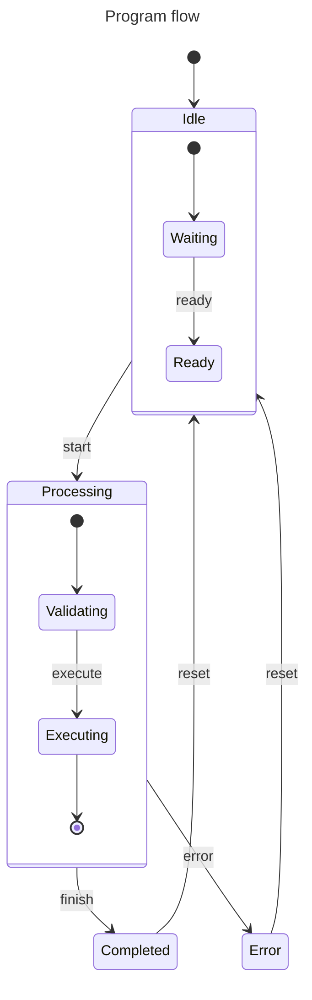

# Mermaid diagram - stateDiagram

doc: [State Diagram Syntax | Mermaid](https://mermaid.js.org/syntax/stateDiagram.html)

```mermaid
---
title: Program flow
---
stateDiagram-v2
    [*] --> Idle
    Idle --> Processing : start
    Processing --> Completed : finish
    Processing --> Error : error
    Error --> Idle : reset
    Completed --> Idle : reset

    state Idle {
        [*] --> Waiting
        Waiting --> Ready : ready
    }

    state Processing {
        [*] --> Validating
        Validating --> Executing : execute
        Executing --> [*]
    }
```
