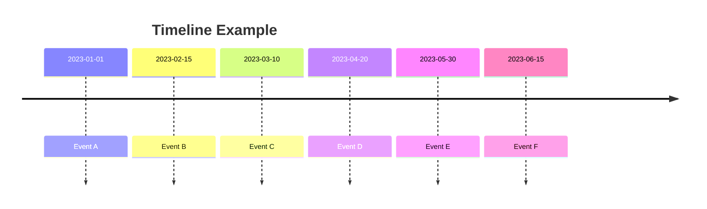

# Mermaid diagram - Timeline

doc: [Timeline Syntax | Mermaid](https://mermaid.js.org/syntax/timeline.html)

```mermaid
timeline
    title Timeline Example
    2023-01-01 : Event A
    2023-02-15 : Event B
    2023-03-10 : Event C
    2023-04-20 : Event D
    2023-05-30 : Event E
    2023-06-15 : Event F
```
